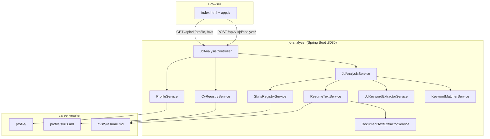

# Architecture

## Purpose

Personal **resume / JD matching** tool for Pradeep C.S.:

1. **career-master/** — markdown source of truth (profile, employers, projects, CV variants).
2. **jd-analyzer/** — Spring Boot 4.0 app that reads career-master, accepts a JD, returns keyword match JSON, serves a browser UI.

Not in production. No auth. Single-user local tool.

## Component diagram



## Analysis flow

```
JD (upload or paste)
  → DocumentTextExtractorService (PDF/DOCX/TXT/MD)
  → JdKeywordExtractorService (rule-based: match against skills.md)
  → KeywordMatcherService (compare keywords vs CV text)
  → JdAnalysisResponse JSON → UI
```

CV text loaded from `career-master/cvs/<slug>/resume.md` (YAML front matter stripped).

## Match score

```
matchScore = (matchedRequired / requiredCount) * 100   // integer division
```

- **≥ 80%** → UI recommends using existing CV.
- **< 80%** → UI recommends tailoring CV (add missing keywords).
- Nice-to-have skills do not affect the percentage.

## What was removed (do not re-add without discussion)

| Removed | Reason |
|---------|--------|
| AnalysisReportWriter | Results shown in UI, not markdown files |
| `writeReport`, `reportSlug` | No file output by default |

## Optional AI mode

Spring AI 2.0 is available via profile `ai` (`application-ai.yml`). Default mode remains rule-based; `KeywordMatcherService` scoring is unchanged.

## Key config

| Property | Default |
|----------|---------|
| `resume-builder.career-master-path` | `../career-master` |
| `resume-builder.default-resume` | `cvs/pradeep-cv-2026-ats/resume.md` |
| `resume-builder.skills-file` | `profile/skills.md` |
| `CAREER_MASTER_PATH` | env override for career-master root |

## Package structure (Java)

```
com.resumebuilder.jdanalyzer
├── JdAnalyzerApplication.java
├── config/ResumeBuilderProperties.java
├── model/          # DTOs: JdAnalysisRequest, JdAnalysisResponse, ProfileSummary, CvSummary, SkillsRegistry
├── service/        # business logic
└── web/            # JdAnalysisController, GlobalExceptionHandler
```

Static UI: `src/main/resources/static/` (served at `/`).
